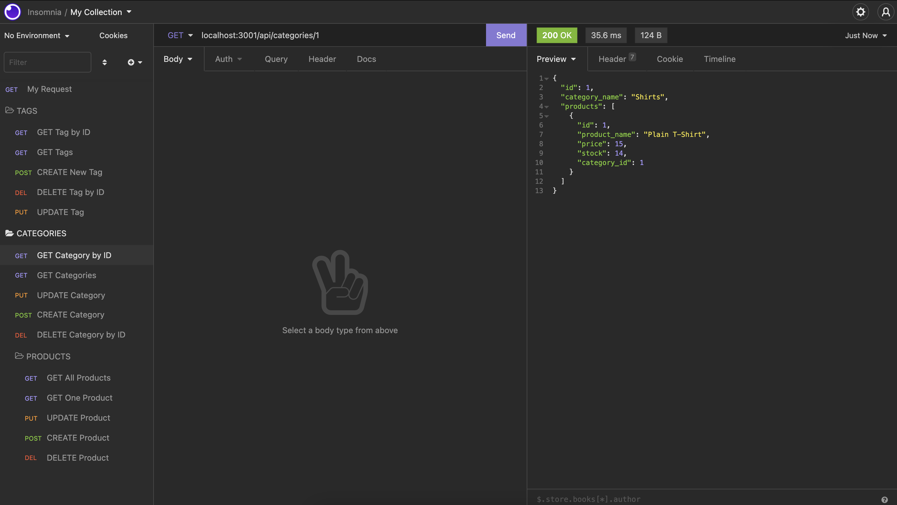
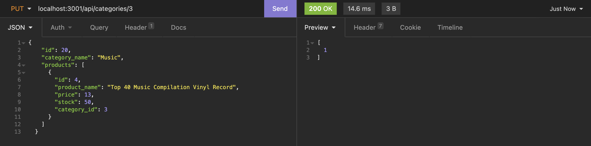
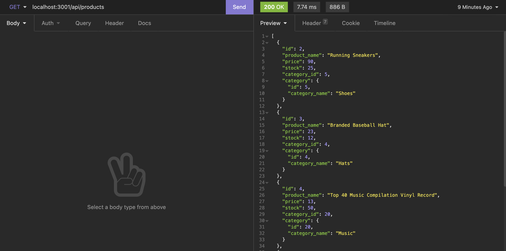

# 🏗️ E-Commerce Back End

Link : https://nameless-castle-62595.herokuapp.com/

## Description 📖

This project is an Internet retail application, also known as **e-commerce**. It is the back end for an e-commerce site.

## Features 📝

The application uses a working Express.js API to use Sequelize to interact with a MySQL database.

## Screenshots 📷 :

* Example of a route getting all category data:

  
  
* Example of a route updating a single category by id:

  

* Example of a route getting all product data:

  
  

## Takeaways 💡

I learned how to configure a working Express.js API to interact with a MySql database using Sequelize.
----
© 2021 Caswell Orr. Confidential and Proprietary. All Rights Reserved.